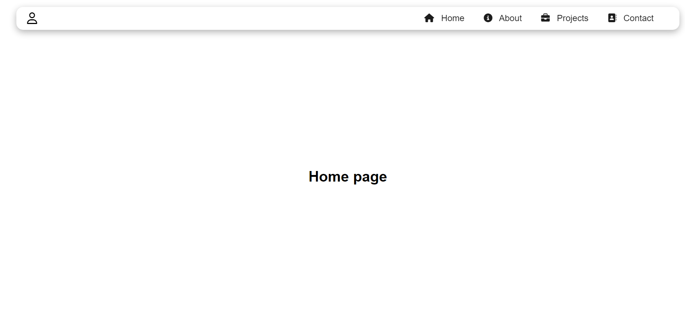
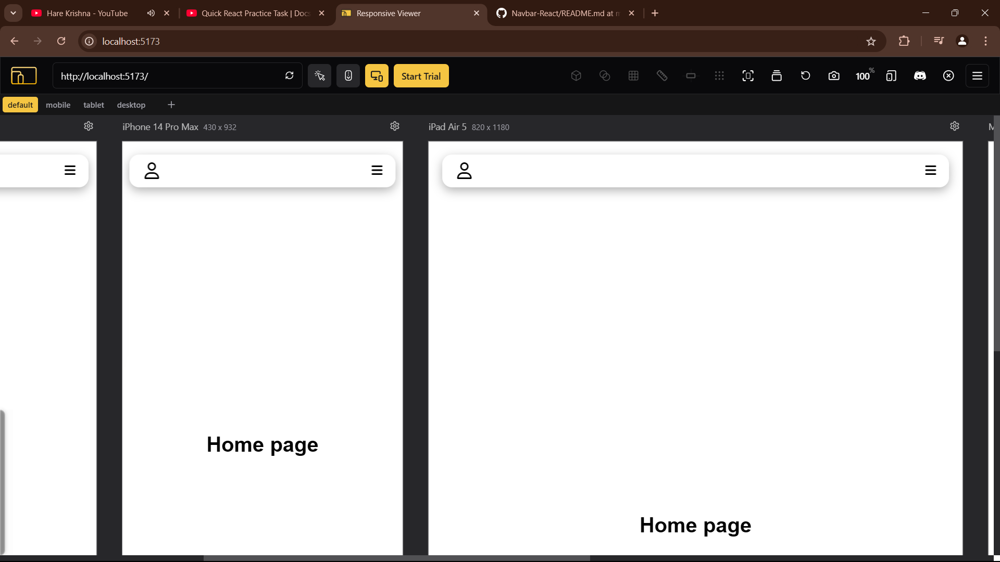

# React Responsive Navbar

A simple and responsive navigation bar built with React. This project demonstrates how to create a clean and modern navbar that adapts to different screen sizes.

## Features

- Responsive design that works on mobile and desktop
- Dropdown menu for nested navigation items
- Easy to customize and extend
- Built with React

## Installation

To get started with this project, follow these steps:

1. Clone the repository:
   ```bash
   git clone https://github.com/Drkadam07/Navbar-React.git

2. Start the development server:
   ```bash
   npm start

## Output


